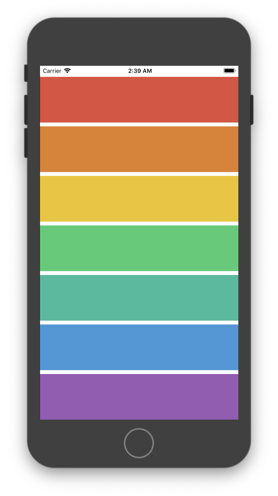

# An iPhone Music App Named: *Xylophone*
This is a *practise project* for iOS app development course.

__What I have learned here:__
1. All about *AVFoundation* & *AudioToolbox* library,
2. All about 'do-catch' block,
3. Using third party code from StackOverflow,
4. About apple's Developer Forum & API Reference.

___
__Screenshot:__

